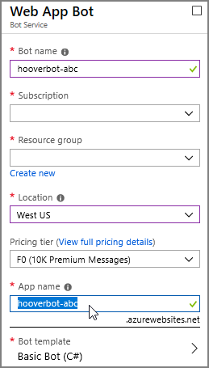

# The Hoover Bot: A Conversational Interface to the JFK Files

The Hoover Bot is a conversational interface to The JFK Files. The JFK Files is a Web app that lets you search a corpus of documents related to the assassination of President John F. Kennedy on November 22, 1963, released by the United States government. Microsoft has presented this technology demonstration, which showcases the power of Azure Cognitive Search, on several occasions.


* [Experience The JFK Files](https://jfk-demo.azurewebsites.net/)
* [The JFK Files GitHub](https://github.com/Microsoft/AzureSearch_JFK_Files)
* [Video presentation](https://channel9.msdn.com/Shows/AI-Show/Using-Cognitive-Search-to-Understand-the-JFK-Documents)

Using the same database as the JFK Files, the Hoover Bot lets you ask a bot based on former FBI director J. Edgar Hoover about the JFK assassination, either by typing or by speaking. When speech is enabled, the bot can answer using a simulation of Hoover's voice. 


The Hoover Bot is a single-page Web app that works in any modern browser. We've tested it in current versions of Microsoft Edge, Mozilla Firefox, and Google Chrome.

The Hoover Bot requires a subscription to the following Microsoft Azure Cognitive Services. A trial or regular free-tier subscription is fine.

* Azure Bot Service: provides the chat-room-like conversational framework.
* Text Analytics: extracts key phrases from user questions for use in search queries.
* Speech Service: provides customized speech recognition and synthesis.

 The document contains instructions for setting up the Azure services used by the demo and building and deploying your own copy of the bot.

**NOTE** The Hoover Bot is a technology demonstration designed solely to illustrate a specific use of Microsoft's technology. It is not intended to be a production-ready application.

## Prerequisites

You will need a Microsoft Azure account, along with subscriptions to the Azure Bot Service, the Text Analytics service, and the Speech Service. Trial or free-tier subscriptions to these services are sufficient. Visual Studio 2017 is also required; the free Community Edition is fine.

The JFK Files is a separate application with a database backend powered by Azure Search. You can find its repository here.

    https://github.com/Microsoft/AzureSearch_JFK_Files

Follow the instructions in the JFK Files repo to create your own instance of the JFK Files. There's a template that will create the necessary Azure services for you. You'll need the URLs for the Azure Search service and the Web Service that were created during setup (you can obtain these from the Azure portal if you don't catch them in the template result).

The Hoover Bot requires that the Cognitive Services enrichment data be stored in the JFK Files database. This is a debugging feature and is not enabled by default. Before initializing your JFK Files instance, edit the file `index.json` in the `JfkWebApiSkills/JfkInitializer` folder in the JFK Files project to add the `enriched` field definition.

```javascript
{
  "fields": [
    // other fields go here.
    {
      "name": "enriched",
      "type": "Edm.String",
      "searchable": false,
      "sortable": false,
      "filterable": false,
      "facetable": false
    }
  ]
}
```

Adding all the JFK Files documents to the index may take a while. We suggest letting the JFK Files initialization process run overnight. You can proceed with the rest of this tutorial whie the JFK Files are being initialized. There are a couple of other long-running setup tasks for the custom speech models, and these can run at the same time as the document indexing.

## Architecture

The Hoover Bot is built using an ordinary client-server architecture. The system consists of two main parts: a C# component that runs in the Azure cloud, and a Web Chat component that runs in the user's browser.


The bot and the Web Chat communicate via the Direct Line protocol. The server-side bot component utilizes the Text Analytics service, while the client-side Web Chat component calls upon the Speech service to perform speech recognition and synthesis.

A typical conversational "turn" (query and response) proceeds as follows. In the following scenario, the user has asked aloud, "Mr. Hoover, what is RYBAT?"


1. The user speaks to the bot. Audio is accepted by the Web Chat component in the browser.
2. The Web Chat component sends the speech audio to the Speech service for recognition.
3. The recognized speech is then sent to the server-side bot component for processing.
4. The bot recognizes the cryptonym (code word) RYBAT in the user's query and sends back its definition.
5. The Web Chat component displays the cryptonym definition, and also sends it to the Speech service to be synthesized into speech using a custom voice resembling that of J. Edgar Hoover.
6. The Web Chat plays the audio definition of RYBAT.
7. Meanhwhile, on the server side, the bot sends the user's question to the Text Analytics service to extract its key phrases.
8. The extracted key phrases are used to construct a search query, which is then sent to the JFK Files back-end, which is an Azure Search instance.
9. The bot builds a card for each matching document returned by Azure Search and sends these to the Web Chat client.
10. The client displays the cards in a carousel, allowing the user to flip through the search results.
11. The client sends the text associated with the cards to the Speech service to turn it into Hoover-speech, then plays the generated audio file.


## Creating the bot

The Hoover bot is based on the `EchoBot` template. The EchoBot simply echoes back whatever you type or say to it, along with a turn counter. We'll use only the skeleton of this bot; the guts will be replaced with code for cryptonym identification and document search. We'll add a customized Web app that includes our own CSS styles and images. Finally, we'll use custom speech and voice services to enable the bot to understand the user's spoken queries and respond using a facsimile of J. Edgar Hoover's voice.

To create the bot on Azure:

1. Create a Web App Bot in the Azure portal by clicking **+ Create a Resource** in the sidebar, then choosing "Web App Bot" under **AI + Machine Learning**. You can also search for "Web App Bot."

    

    This style of bot includes a Web hosting component, which we'll use to host the Web page containing a chat interface to the bot. The free pricing tier is suitable for developing the bot. Choose "EchoBot (C#)" as the template.

    

    Your bot will be hosted on a subdomain of `azurewebsites.net`. Therefore, its name must be unique among all other Azure Web sites. Try `hooverbot-abc` where `abc` are your initials, or variations on this theme. Valid characters are letters (not case sensitive), numbers, and hyphens.

1. Download the source code for the bot from the Build blade of the new Web App Bot resource. This download is a Visual Studio solution that we will customize with our own code and resources. We could start a project from scratch, but it's easier to start with one created by the Bot Service, because it already includes the information needed to publish and run the bot in the Azure cloud.

    

1. Open the `EchoBotWithCounter.sln` file to launch Visual Studio and open the project.

1. Using NuGet (**Tools > NuGet Package Manager**), add the following libraries:

    

    * `Microsoft.Azure.Search.Data`, the Azure search client.
    * `Microsoft.Azure.CognitiveServices.Language.TextAnalytics`, the Text Analytics client. You may need to enable the Include Prereleases checkbox to find this package. At this writing, it is in preview release.
    * `Microsoft.AdaptiveCards`, flexible cards for bot responses.
    * `Newtonsoft.Json`, a parser for JSON files.

1. Copy the files from the `bot` folder of this repository to the *top level* of the Visual Studio project. Some of the files have the same names as files already in the project. Allow the files being copied to replace the existing ones.

1. Open `appsettings.json` and enter the required values. 

    

    You can find the values you need in the Azure dashboard.

    * `botFilePath` and `botFileSecret` can be found in the Application Settings blade of your Web App Bot (scroll down to the Application Settings heading).

    * `searchName` and `searchKey` can be found in the Keys blade of your JFK Files search service. The `searchName` is the name of the resource, which is displayed in bold at the top of the blade. 

        We suggest that you not use an admin key with the Hoover Bot. Instead, click **Manage query keys** to obtain a query key. The query key can only be used for searches, which prevents others from obtaining administrative access to your Azure Search instance if the key is compromised.

        

    * The `searchIndex` name should already be `jfkindex` in `appsettings.json`. Do not change it.

    * Change the hostname of the `SearchUrl` field (the part after `https://` where it currently says `jfk-site-hostname`) to have the hostname of your own JFK Files Web app instance that you created earlier.

    * `textAnalyticsKey` can be found in the Keys blade of your Text Analytics resource. `textAnalyticsEndpoint` must be edited to reflect your Text Analytics region if it is not `westus`. Do not make any other changes to this URL.

1. Copy the files from this repo's `wwwroot` folder into the Visual Studio project's `wwwroot` folder. These files contain the bot's user interface and client-side logic. Again, allow same-named files to replace existing files.

1. Make sure the project builds and runs. Use **Build > Rebuild Solution** for your first build to make sure no traces of the original EchoWithCounterBot code remain.

1. With the project running, try your bot in the [emulator](https://docs.microsoft.com/en-us/azure/bot-service/bot-service-debug-emulator?view=azure-bot-service-4.0). Just double-click the `.bot` file in Visual Studio.

    

    **NOTE** The `.bot` file is encrypted. The first time you open your bot in the Emulator, you'll be prompted for your bot secret; it's the same secret you pasted into `appsettings.json`.
 
Running the project also opens the Web Chat app in a browser. This app connects to a version of the bot running in the Azure cloud. It won't work until you publish the bot. For now, use the emulator to test the unpublished version of your bot. There are a few more things to do before the bot is ready to be hosted in the cloud.

## Hooking up Web Chat

Azure Bot Service's Web Chat is a JavaScript component that lets you embed your bot in any Web site. We'll use it in the J. Edgar Hoover Bot Web page. 

To get Web Chat to talk to your bot, you must enable the bot's Direct Line channel and provide an authentication token in the `settings.js` file in the `wwwroot` folder.

1. In the Azure portal, enable Direct Line in your Web App Bot's Channels blade. 

    **NOTE** There's already a Web Chat channel in the Channels blade, which you might think is the one you want. This refers to the v3 Web Chat feature. We're using the v4 Web Chat, which uses the Direct Line protocol.

1. Click the globe icon to add this channel.

    

1. Click Add New Site.

   

1. Enter "Direct Line" as the name of the new site. Keys are generated and the configuration page for the new Direct Line connection appears.

   

1. Click **Show** to reveal one of your keys, then copy it and paste it into `settings.js` (in `wwwroot`) in place of the placeholder text. 

    

    Don't worry about the other items in `settings.js` yet; we'll fill them in later.

1. Save `settings.js` and publish your bot.

**NOTE** For more help, see [Connect a bot to Direct Line](https://docs.microsoft.com/en-us/azure/bot-service/bot-service-channel-connect-directline?view=azure-bot-service-3.0).

After you've added the Direct Line secret to `settings.js` and published the bot, you can try it in a browser.

**IMPORTANT**  The Hoover Bot is a technology demonstration and is not intended to be a production application. Your bot and speech subscription keys are embedded in the source code of `settings.js`, which is accessible on the bot's Web site. The keys can therefore easily be obtained by anyone with access to the site and used in others' apps under your subscription. If you're using trial or free tier keys, at worst your bot might stop working because too many requests are being made with your keys. We do not recommend using paid keys for the Hoover Bot, as this could cost you actual money. You are always responsible for the security of your keys and for all requests made under your subscription.

## Publishing your bot

Publish your bot to the Azure cloud by following these steps.

1. Open the file `[botname].PublishSettings` in your Visual Studio project's `PostDeployScripts` folder. For example, if your bot's Azure name is `hooverbot-abc`, the file is named `hooverbot-abc.PublishSettings`.

1. Find the password (value of `userPWD` field) in this file and copy it to the clipboard.

1. Right-click the project in the Solution Explorer and choose **Publish** to open the Publish page.

    

1. On the Publish page, click **Publish**.

1. When you're asked for the password, paste it into the password field and click **OK**.
 
After your code has been published, the Hoover Bot's Web site opens in your browser. It may take a moment for the site to "warm up" after being restarted as part of deployment.

To make publishing easier the next time, save your deployment password. Click **Configure** in the Publish page and paste the password in the appropriate field, then click **Save**.

## Adding voice input and output

It is straightforward to add speech recognition and voice response Web Chat using its integration with the Azure Speech Service. However, at this time, this integration does not support custom speech models or voices, both of which we use in our bot.

* A custom language model helps assure that the bot recognizes the cryptonyms (code names) used for certain persons, programs, and events.

* A custom voice allows the bot to respond using a facsimile of J. Edgar Hoover's voice.

So instead of using the Web Chat's speech functions, we'll use the Speech Service JavaScript SDK, which does have support for custom models. We'll use the Web Chat's Direct Line connection to send recognized utterances to the bot, and we'll subscribe to Direct Line events to obtain responses from the bot that need to be spoken.

### Customizing Speech Synthesis

To make our bot's voice sound like J. Edgar Hoover, we need recordings of his voice, along with a text transcript of each recording. We located a 21-minute minute recording of a November 1963 phone call between Hoover and President Lyndon B. Johnson. From this audio, we extracted nearly 200 utterances, edited them slightly to remove "disfluencies" like repetitions and filler such as "ah" and "um," and transcribed them into text.

The quality of the recording isn't ideal. It's a telephone call to begin with, and the recording is old and contains a lot of static. We can't use any audio where Johnson and Hoover are speaking at the same time, which happens frequently. It would be better, as well, if we had a lot more utterances. Still, even with just a couple hundred utterances, the synthesized voice is recognizably Hoover's. There are other recorded phone conversations between Johnson and Hoover that could provide further utterances if you want to improve the voice's quality.

**TIP** We used the free [Audacity](https://www.audacityteam.org/) audio editor to prepare the audio samples. Audacity lets you "tag" segments of audio within the file, then export the tagged sections using the tag names as filenames. If you want to add more utterances, you'll find Audacity up to the task.

After extracting the utterances, we created a ZIP archive containing a numbered audio file for each utterance, along with a text file that holds the number of the file, a tab (code point 9), and the text of the utterance. The text has been normalized, spelling out numbers and abbreviations. And now we pass this data on to you.

To create your custom voice using this data set:

1. Log in to the Custom Voice and Speech portal, [cris.ai](http://cris.ai), with the same Microsoft account you use for your Azure subscriptions.

    The first time you log in, you'll be asked to associate your Custom Voice and Speech account with a Speech Service subscription.

    

    Click **Connect existing subscription**, then enter either of the subscription keys for your Speech Service subscription and click **Add.**

1. Upload the `hoover.zip` file and the `transcript.txt` file (both in the `voice` folder) to the Data page of the Custom Voice portal. Click **Import Data**, fill in the Import Voice data form and choose the transcript and voice files, and click **Import**. 
    
    
     
1. Wait until the Status column in the My Voice Data page reads "Succeeded."

1. Switch to the Models page and click **Create New** to use this data set to train the custom voice. Choose the data set you just uploaded and fill in the rest of the requested information, then click **Create**.

    

    This operation can take a significant amount of time, so perhaps let it run overnight. You can train a custom speech model at the same time (see next section).

1. After the new custom voice has been created, click **Deploy** next to the new voice in the Models page to create a new endpoint.

    

    Enter the name and description as requested, then click **Create**.

It takes a moment to create the new endpoint. You'll find the URL next to the endpoint on the Endpoints page. Take note of it; we'll need it in the Hoover bot Web app.

For full details on the uploading and training process, see [Creating custom voice fonts](https://docs.microsoft.com/azure/cognitive-services/speech-service/how-to-customize-voice-font).

### Customizing Speech Recognition

The JFK assassination documents include a number of terms not found in everyday English. Chief among these are the cryptonyms (code names) representing various persons, operations, locations, events, and even categories of secrecy. The cryptonym for Lee Harvey Oswald, for example, is GPLOOR. It's important that when the user speaks "g p floor" that it's recognized as the cryptonym GPFLOOR so that it can be successfully used in a query. This can be done by customizing the *pronunciation model* of the speech-to-text function of the Speech service.

The pronunciation data to be submitted to the Custom Speech portal is a simple UTF-8 or ASCII text file containing the "display form" of the term ("GPFLOOR" in this case), a tab character (code point 9), and the pronunciation of the term (here, "g p floor").

There are hundreds of known CIA cryptonyms. Fortunately, the JFK Files search demo includes a list of them, along with a description of each, in the `CryptonymLinker` skill for Cognitive Search. We have converted this list to the format required by the Custom Speech portal, removed the descriptions, and added the pronunciation of each term. The resulting file is included here as `cryptonyms.txt` in the `speech` folder. (Not to be confused with `cryptonyms.json` in the `bot` folder, which contains the definitions for use by the bot's back-end to send back definitions of cryptonyms.)

Some cryptonyms are regular English words, like ZIPPER. There are still included in the pronunciation data because they should appear in their all-uppercase form when recognized. We've also included "JFK," which is not a cryptonym, but should be recognized as a single word.

**TIP** Pronunciations are given priority based on their order in the pronunciation file. To prevent shorter cryptonyms from being recognized prematurely when a cryptomym begins with a prefix that is itself a cryptonym, (e.g. recognizing "GP" instead of "GPFLOOR", then recognizing "floor" separately as a regular English word), we sorted the pronunciation file in reverse alphabetical order. This way, GPFLOOR comes before GP, and has priority over GP in recognition.

**BTW** Searching the JFK Files for "JFK" is not actually very useful, because nearly every document in the collection, even those related to other individuals, includes a cover page indicating that the document is part of the "JFK Assassination System." In many documents, a notice containing "JFK" appears on *every* page.

Creating a custom language model using the cryptonym pronunciation data also requires language data; you can't train a language model without both files. The language file contains phrases or sentences that are likely to be uttered by a user. The language data is treated as an addition to a base model provided by Microsoft, so it needn't be extensive. We have provided a file, `questions.txt`, consisting of a handful of sample questions that users might ask the Hoover Bot.

With these two files, you're ready to adapt Speech Recognition.

1. Log in to the Custom Voice and Speech portal, [cris.ai](http://cris.ai), with the same Microsoft account you use for your Azure subscriptions.

1. Upload `cryptonyms.txt` as a pronunciation data set and `questions.txt` as a language data set to the Adaptation Data page of the Custom Speech portal. Both are in the `speech` folder of this repo.

    First, click **Import** next to Language Data Sets, fill out the form, and attach `questions.txt`. Click **Import** to proceed.

    

    Then click **Import** next to Pronunciation Data Sets, fill out the form, and attach `cryptonyms.txt`. Again click **Import** to proceed.

    It takes a moment to process the new data sets. Wait until both data sets have a status of Succeeded before continuing.

1. Switch to the Language Models page and click **Create New** to use these data sets to train the speech recognizer. 
 
    

    Fill out the form as shown, choose the language and pronunciation data sets you just uploaded, and click **Create.**

    Creating the language model can take a significant amount of time; you might want to do it overnight. It can run simultaneously with custom voice training and database indexing.

1. Create an endpoint to be used with the custom speech model by clicking **Create New** on the Endpoints page.

    

    Once more, fill out the form, choose the v3.3 Unified acoustic model and the language model you just created, and click **Create.**

    It may take a few moments to deploy the endpoint. When the endpoint's Status on the Endpoints page is Succeeded, click its Details button and scroll down to the Endpoints table to find the WebSockets (`wss://`) URL you need. You want the second one listed, the one thot supports up to 10 minutes of dictation but not punctuation.

For full details on the uploading and training process, see [Enable custom pronunciation](https://docs.microsoft.com/azure/cognitive-services/speech-service/how-to-customize-pronunciation), [Create a custom language model](https://docs.microsoft.com/azure/cognitive-services/speech-service/how-to-customize-language-model). and [Create a custom speech-to-text endpoint](https://docs.microsoft.com/azure/cognitive-services/speech-service/how-to-create-custom-endpoint).

### Enabling custom speech in the Web app

1. Open the `settings.js` file again (in `wwwroot`) and add your your Speech key and the required custom Speech and Voice endpoints where indicated. 

    These are the endpoints you made a note of when you created the custom voice and speech models. If you didn't copy them, you can find your key in the Azure dashboard and the endpoints in the [cris.ai portal](http://cris.ai/). 

    The token endpoint just needs the hostname edited to reflect the region your subscription is in. If it's in `westus`, you don't have to change it at all.

1. Build and publish the bot as before. The bot's Web Chat opens in a browser. It takes a moment for the bot to "warm up" after the service is restarted, so wait patiently until the bot displays its greeting. 

With the bot open in the browser, you can activate the "Use speech" checkbox. After Hoover's voice greets you, you can ask him questions by addressing him as "Mr. Hoover," for example, "Mr. Hoover, what does GPFLOOR mean?"

The bot's speech recognition is temporarily disabled while the bot is speaking. Recognition turns off automatically after twenty seconds without detected speech.

## Technical details

The bot's server-side logic is in `EchoWithCounterBot.cs`. Here are some high points.

* There are some static constants early on that can be changed to customize the bot's stock responses to greetings and other social niceties, or to change the maximum number of search results displayed.

* Sending the initial greeting ("Hello, fellow investigator!") is more tricky than it might seem at first. When a chat starts, the bot receives a `ConversationUpdate` event for itself joining the chat and another for the user. So one part of a successful greeting strategy is to ignore the bot's event and respond only to the actual user joining the chat. Also, only one instance of the bot is created for all users of the Web Chat, so we must make sure each Web Chat user has their own user ID. On top of all that, Web Chat doesn't send `ConversationUpdate` until the user sends his or her first message, so we need some way to force the chat to begin. (We'll see how we deal with the latter two issues in a bit).

* Requests are processed by the method `OnTurnAsync`. This method calls upon other methods to respond to four kinds of user requests. 

    1. It detects users joining the chat and sends an initial greeting message.
    1. It detects greetings, welcomes, and thank-yous, and responds with a canned phrase.
    1. It detects cryptonyms in user requests and responds with a definition. 
    1. It extracts keywords from user requests and executes search queries against the JFK Files' Azure Search back-end.

* To turn the user's question into a suitable keyword query, we use the Text Analytics service. First we extract key phrases, tweaking the results slightly since some detected key phrases don't make good search keywords. Then we extract entities. We don't use the names of the detected entities directly, but rather use the recognition of an entity as an indication that some part of the user's question is important. Recognized cryptonyms are also included in the keywords.

* In the search query code, there's a `do`/`while` loop that sends a typing indicator while the bot is performing the search. Typing indicators are a good way to let the user know the bot is still working on something for them, and is especially useful here since JFK Files queries can take several seconds. AFter the typing message is sent, the Web Chat client displays a "..." animation for three seconds, or until another message is received from the bot. If a search takes longer than three seconds, the disappearance of the typing indicator can lead to the user thinking the bot has stopped responding; they might then be surprised when the bot spits out its results later, seemingly at random. So we continue sending a typing message every two seconds while the search completes, and a final one as we begin preparing the response.

* Finally, search results are put together into a "carousel" of cards, each bearing an image thumbnail and text extracted from the document. The card layout uses a custom `AdaptiveCard` class. Since most documents begin with a cover page that looks similar across the entire archive, we use the second page's thumbnail in multi-page documents to give each result a visually-distinguishable thumbnail, and the beginning of the second page's text as a summary of the document.

Client-side, you'll find all our logic in `bot.htm`. This document is included into the main Hoover Bot page `default.htm` using an HTML `<iframe>` tag. In `bot.htm`, you'll also find CSS rules for styling the chat (including one to remove the Upload button, which we don't use) and HTML and JavaScript code. Here's an overview.

* We generate a unique user ID using `Date.now()`, which is milliseconds since January 1, 1970. All Web Chat users should have unique names. This time-based name is plenty unique enough for our purposes.

* Similarly, remember how we mentioned that Web Chat doesn't tell the bot a user has joined until that user sends a message? We work around that by manually sending a message. Our "back channel" event message is actually ignored by the server-side code, but it ensures that Web Chat fully initializes the chat and sends a `ConversationUpdate` to the bot, so it can then respond with a greeting.

* You'll notice that when defined the `user` and `bot` objects, which represent the two user accounts in our Web Chat, we made sure to assigne the correct `role` to each. This ensures that when we send a speech-derived question to the bot, that message is right-justified in the chat window just as though the user had typed it.

* We create a Direct Line connection and render the Web Chat interface pretty much exactly as you'll see it in Bot Framework tutorials. However, we also subscribe to events that have a `speak` attribute so we can speak the bot's responses aloud. Server-side, we always set a `speak` attribute on messages that we want to be spoken if the user has turned on speech.

Speaking of speech, as previously mentioned, the Web Chat app supports the Speech Service, but it does not yet support custom speech and voice models. To integrate custom speech with the Web app, then, we have used the following approaches.

* For speech-to-text, we use the Speech Service JavaScript SDK's asynchronous speech recognition API. When the SDK recognizes a complete utterance, it is passed to a function that checks to see if the bot is being addressed (the utterance begins with "Mr. Hoover") and, if so, uses the Direct Line API to transmit the utterance to the bot. It appears in the chat window soon afterward.

    Why didn't we just stuff the utterance into the input field and simulate a click on the Send button? The Web Chat requires actual user typing to fill the input field. We do put the query into the input field momentarily to make the recognized utterance more visible.

* For text-to-speech, we use the Speech Service's REST API to request an MP3 file of the utterance, then play that file using HTML 5 audio. Two queues are used: one for making requests to the Speech Service, and another for playing the audio files. This way, synthesis and playback can overlap, but the bot's spoken responses won't.

* We temporarily disable speech recognition while the bot is talking. This prevents wasting bandwidth on recognizing the bot's own utterances and possibly sending spurious queries.

* We use a client-side per-session cache for audio generated by speech synthesis for messages having a "cacheable" flag set by the server. Since we use a lot of the same phrases again and again, this saves us the time and bandwidth of repeatedly synthesizing the same text. On the other hand, there are many cryptonym definitions, and it is unlikely that any given definition will be requested more than once, so these aren't cached.

## Troubleshooting

The first troubleshooting step is always to double-check the keys and endpoints in `appsettings.json` and `settings.js`. The following FAQ offers additional suggestions to various issues you may encounter.

### Q: I can't get my bot to work with the Bot Framework Emulator (it can't connect).

A: Make sure the Visual Studio bot project is running and that you are connecting by opening the project's `.bot` file in the Emulator.

The Emulator's network connection may be blocked by the Windows firewall. You can add a rule to allow connections to port 3978 (the default bot connection port).

### Q: While opening Web Chat in a browser from the local `default.htm` page and attempting to use speech, the browser frequently asks for permission to use the microphone.

A: The Web Chat app turns speech recognition off while the bot is speaking, and also turns it off after no speech has been detected for twenty seconds. For locally-hosted files, this may cause you to be prompted for permission to use the microphone each time the microphone is re-enabled. This behavior is a security precaution, and most browsers don't have a way to turn the warning off for locally-hosted files. Instead, while the bot is running locally (press F5 in Visual Studio), access the page through `http://localhost:3839` using Chrome. Chrome will retain the microphone permission for the session.

### Q: I don't hear any responses in Hoover's voice while speech is on.

A: Another precaution taken by browser makers to protect users from malicious code in local files. See previous answer for the solution.

### Q: My microphone doesn't work; the bot never recognizes what I say.

A: Make sure you are prefacing each request with "Mr. Hoover." Make sure your audio quality is good (record yourself saying something using Windows' Voice Recorder app, for example). 

Finally, check the browser's console (press F12 in Chrome or Edge, or Control-Shift-K in Firefox) while toggling speech on. If your browser can't access the microphone, a `NotAllowed` error message or similar appears in the browser console. Make sure your browser's settings grant it access to the microphone.

### Q: The bot doesn't respond, or tells me something seems to have gone wrong.

A: The "gone wrong" message indicates an unhandled exception on the server side of the bot. You can view the server-side log in the Log Stream blade in the bot's App Service resource to help you figure it out. 

Some problems of this nature are capacity issues (too many sessions at once for your subscription plan) or are transient. Transient errors are more common when you have just published a new version of the bot from Visual Studio or restart the bot for some other reason. Just wait a moment and reload the page.

### Q: The speech checkbox keeps turning off.

A: Speech recognition automatically turns off after twenty seconds without speech. (It could be other sound as long as it doesn't contain speech.) To recognize speech continuously, change this line:

    speechRecognizer.speechEndDetected = _ => element.checked && element.click();

 to:

    speechRecognizer.speechEndDetected = _ => speechRecognizer.startContinuousRecognitionAsync();

With this code, speech recognition re-enable itselfs automatically when it times out. This workaround may not be necessary with future versions of the Speech SDK.

### Q: The bot doesn't load in the browser, is slow to respond, or doesn't send its initial greeting for a long time.

A: This can happen after you restart the bot or publish a new version from Visual Studio (which necessitates a restart). Just wait a moment and reload the page.

### Q: I'm running the bot in Visual Studio, but the bot's behavior doesn't reflect the changes I have made recently to the source code.

A: The Web Chat launched by the build process uses the version of the bot running in the Azure cloud. Use the Bot Framework Emulator to test the local bot, or else publish the project.

If the problem persists, try doing a full rebuild in Visual Studio (**Build** > **Rebuild Solution** from the Visual Studio menu bar).

### Q: What are `CounterState.cs` and `EchoBotAccessors.cs` used for?

Q: In the Hoover Bot, nothing. These files are left over from the `EchoBot` sample that you initally downloaded. You can ignore them (or [check out that sample](https://github.com/Microsoft/BotBuilder-Samples/tree/master/samples), of course).

### Q: How do I upgrade the Bot and Speech libraries?

A: For the server-side C# application, use NuGet to update your libraries. 

The Bot Framework JavaScript library is delivered by a CDN and always uses the latest publicly-available release. (You can replace `latest` with `master` in the `<script>` tag's URL to try the latest pre-release version.)

The Speech Service JavaScript library is provided as part of this project and served from the same Azure Web site that hosts the bot. [Download the latest version](https://aka.ms/csspeech/jsbrowserpackage) and copy `microsoft.cognitiveservices.speech.sdk.bundle-min.js` from the zip file into the Visual Studio project's `wwwroot` folder.

Updating client libraries may require minor changes to the C# or JavaScript code.
